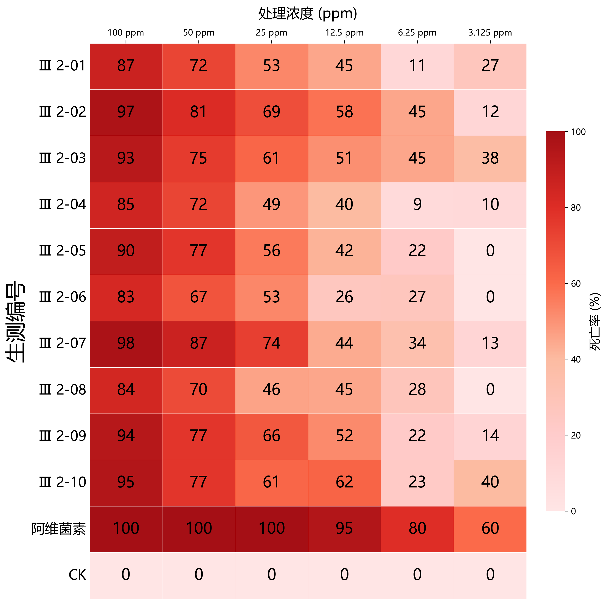
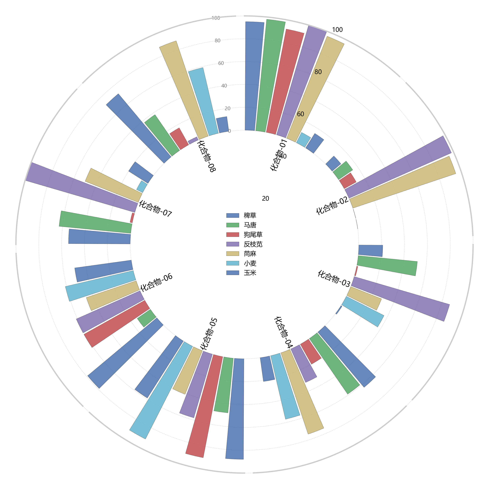
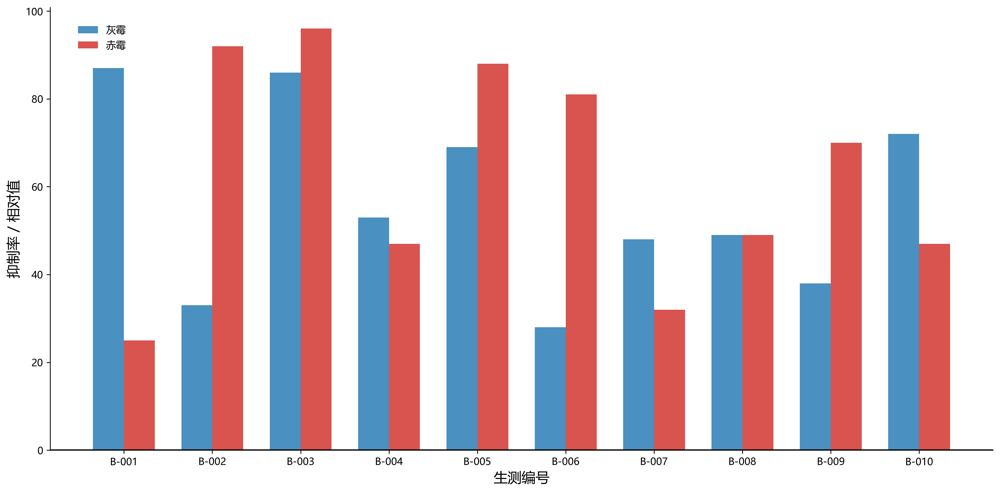
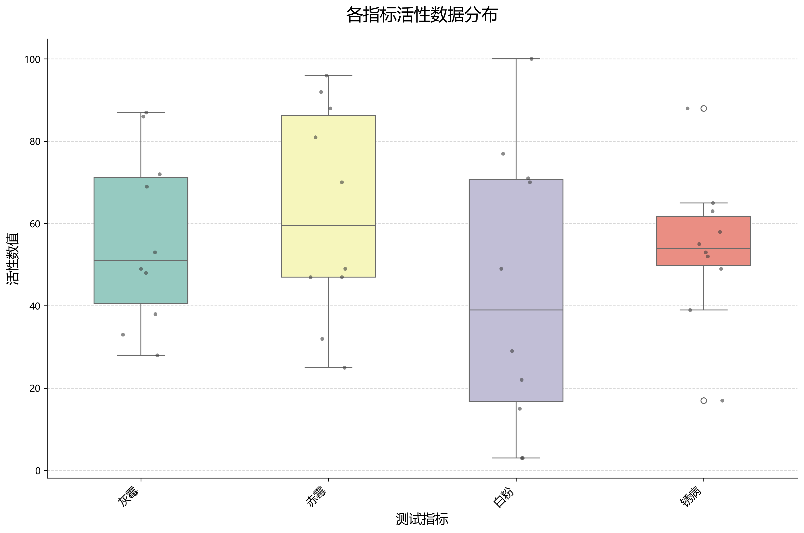
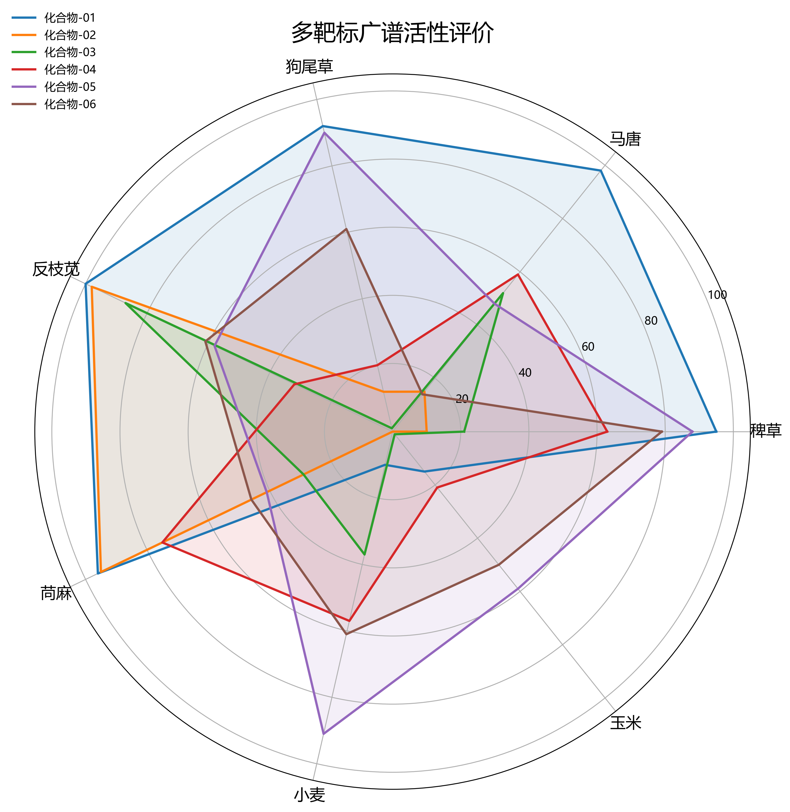
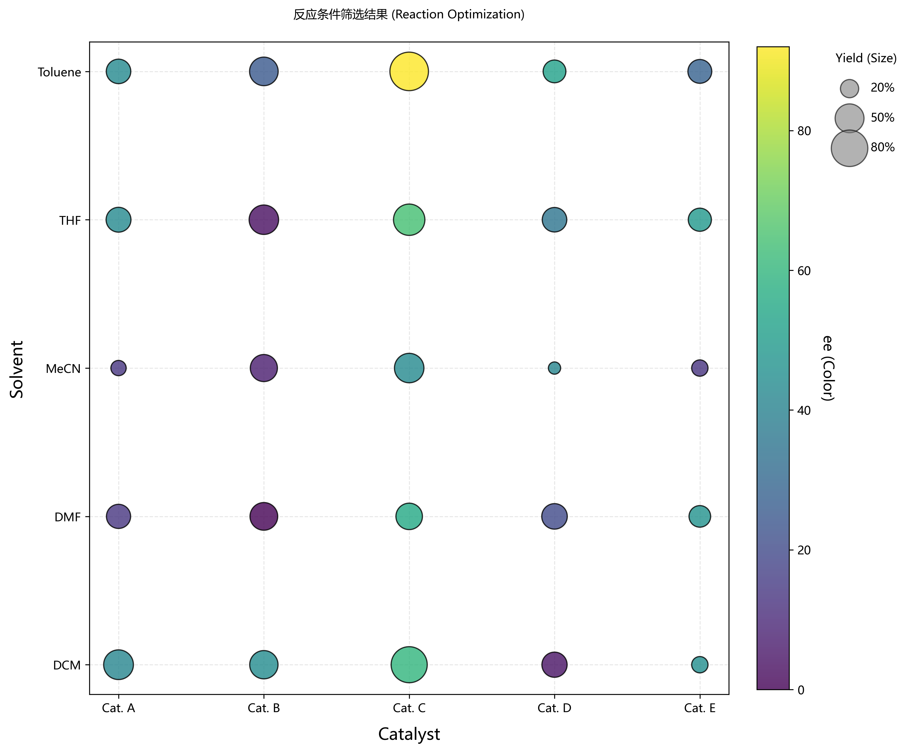
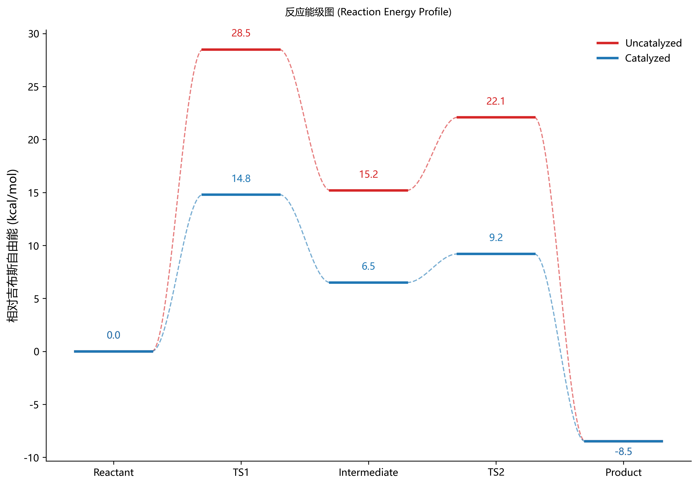
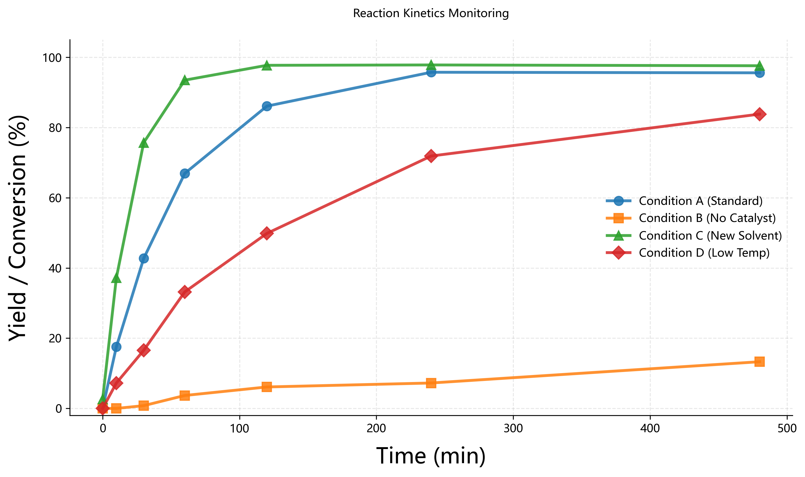

# Bioassay & Chemistry Data Visualization Tool (生测与化学数据可视化工具)

这是一个基于 **Python Streamlit** 开发的 Web 可视化工具，专为生物测定（Bioassay）和有机合成（Organic Synthesis）领域的数据分析而设计。它能够将 Excel 数据快速转换为出版级（Publication-Ready）的高质量图表。

## 🌟 主要功能 (Features)

本项目包含 8 个核心可视化模块，满足不同的科研场景需求：

### 1. 活性热图 (Heatmap)
*   **用途**: 展示多样本在不同浓度下的活性分布。
*   **特点**: 支持自动排序（罗马数字/数字）、长列表自动分割。
*   **输出**: 高清热图，包含具体的活性数值。
*   

### 2. 除草活性极坐标图 (Polar Bar)
*   **用途**: 展示除草剂对多种作物的活性。
*   **特点**: 独特的极坐标柱状图设计，美观且能直观展示选择性。
*   

### 3. 除菌活性柱状图 (Bar Chart)
*   **用途**: 专门用于对比灰霉病和赤霉病的抑制活性。
*   **特点**: 标准双柱对比图，清晰展示差异。
*   

### 4. 数据分布箱线图 (Boxplot)
*   **用途**: 统计和展示一组数据的分布情况（中位数、四分位数）。
*   **特点**: 叠加散点（Jitter），可同时看到分布趋势和原始数据点，便于发现异常值。
*   

### 5. 广谱活性雷达图 (Radar Chart)
*   **用途**: 综合评价一个化合物对多个靶标的广谱活性。
*   **特点**: 多维雷达图，直观展示化合物的综合性能。
*   

### 6. 反应条件筛选气泡图 (Optimization Bubble Plot)
*   **用途**: 可视化化学反应条件筛选结果。
*   **特点**: 
    *   **X轴/Y轴**: 催化剂/溶剂等条件。
    *   **气泡大小**: 代表产率 (Yield)。
    *   **气泡颜色**: 代表对映选择性 (ee值)。
*   

### 7. 反应能级图 (Reaction Energy Profile)
*   **用途**: 展示 DFT 计算的化学反应路径能量变化。
*   **特点**: 绘制标准的能级阶梯图，并用平滑曲线连接各步骤，支持多路径对比。
*   

### 8. 反应动力学曲线 (Reaction Kinetics)
*   **用途**: 监测反应产率随时间的变化，研究反应速率。
*   **特点**: 支持多条曲线对比，自动分配清晰的标记点。
*   

---

## 🚀 快速开始 (Quick Start)

### 1. 安装依赖
请确保已安装 Python (3.8+)，然后在终端运行：
```bash
pip install -r requirements.txt
```

### 2. 运行应用
```bash
streamlit run app.py
```
应用启动后，浏览器将自动打开 `http://localhost:8501`。

### 3. 数据准备
请准备 Excel 文件 (`.xlsx`)。不同图表对数据格式有特定要求，详见应用内的侧边栏说明。

---

## 🛠️ 技术栈
*   **Frontend**: [Streamlit](https://streamlit.io/)
*   **Data Processing**: [Pandas](https://pandas.pydata.org/), [NumPy](https://numpy.org/)
*   **Visualization**: [Matplotlib](https://matplotlib.org/), [Seaborn](https://seaborn.pydata.org/)

## 📄 License
MIT License